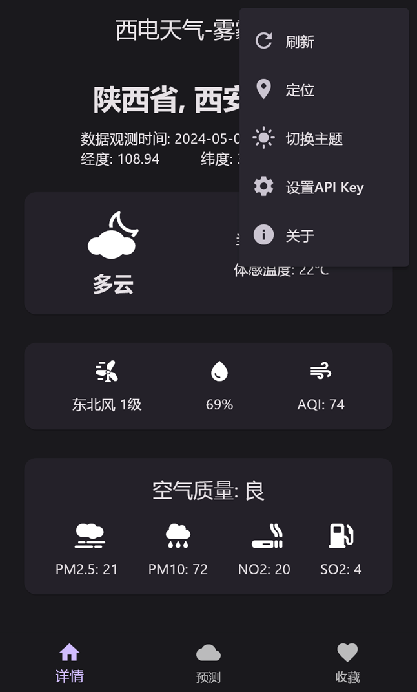
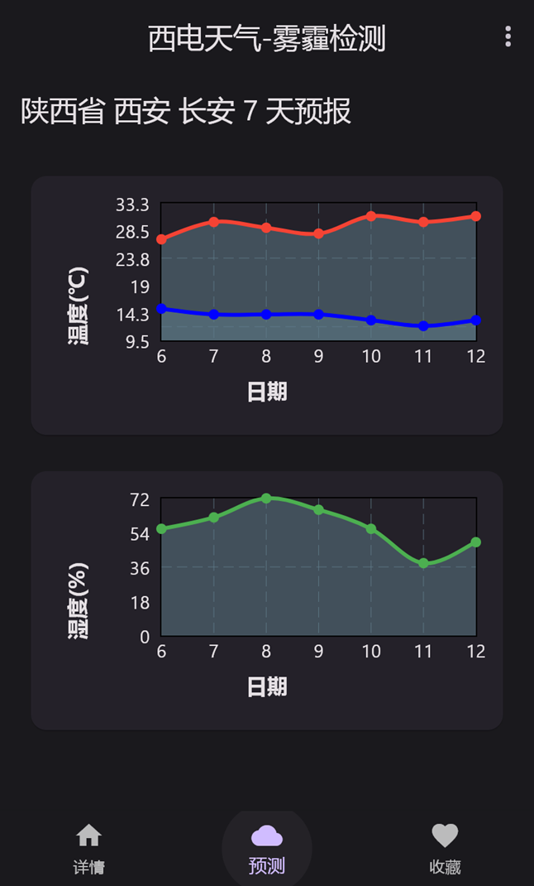
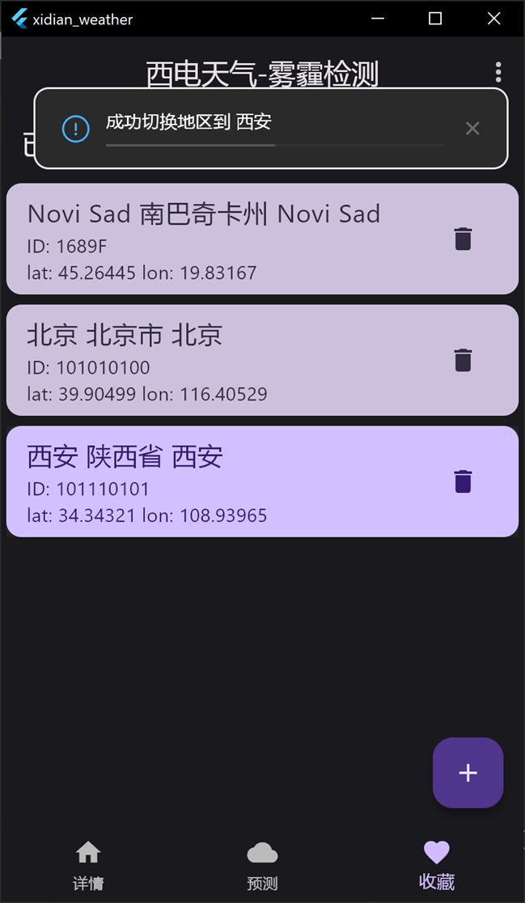

# xidian_weather

A new Flutter project.
author: <chocolatedesue@outlook.com>

## 参考

1. 和风天气开发文档: <https://dev.qweather.com/docs/>
2. ui设计 应用原型大概参考这个应用 <https://github.com/MGAndroidProjects/WeatherWise-Releases>

## quick start

1. git clone xx, cd xx
2. create .env file in root dir, add `APIKEY=your_key` where your_key is your hefeng weather api key, <https://dev.qweather.com/docs/api/>
3. flutter pub get
4. dart run build_runner clean &&  dart run build_runner build --delete-conflicting-outputs
5. flutter run

## notice

1. api中存在可能空值， 未作处理
2. ios macos位置权限未声明
<!-- // 3. sqlite 实现savedCity增删改查 -->
<!-- 4. test 可能出错，要注释掉sp的初始化 -->
3. 组件initstate不能声明为async，否则无法加载
4. 字体颜色问题
5. 若要复用action, 需要在github secret中添加APIKEY
6. 如果跑不通，可以手动指定apikey

## feature

1. 支持自选地域 保存
2. 可以定位
3. 使用和风天气api
4. 对使用体验和外观做了优化

## TODO

1. apikey 写死了， public记得修改
2. 安卓没有签名， 可能不方便覆盖安装

screenshot

